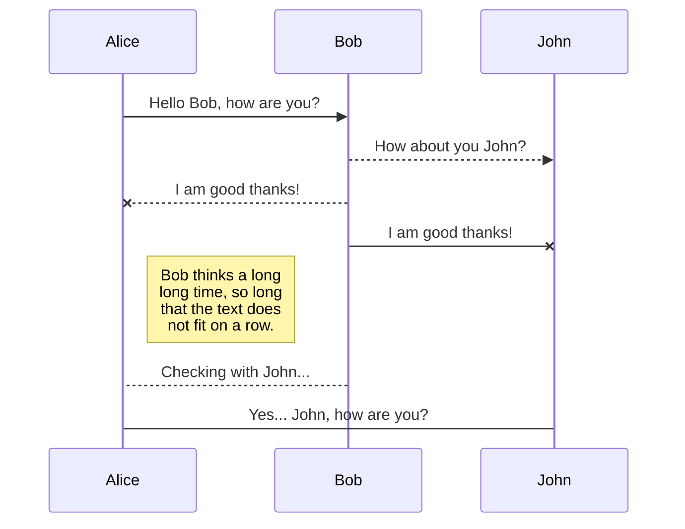
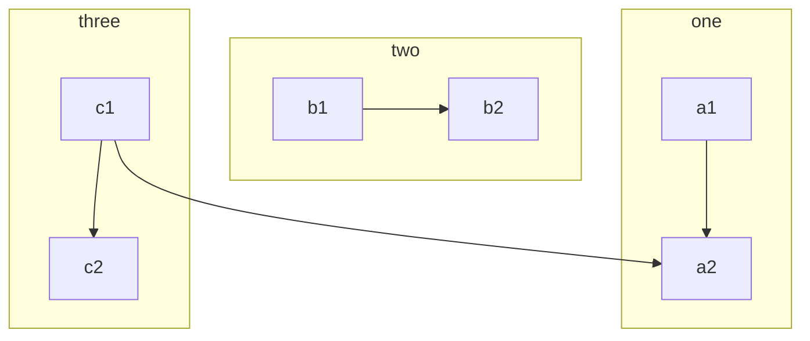

# new evening
``` ruby
<!DOCTYPE html>
<html>
<head>
    <title>Example HTML Page</title>
</head>
<body>
    <h1>Hello, world!</h1>
    <p>This is an example HTML page.</p>
</body>
</html>
```


## KaTeX

You can render LaTeX mathematical expressions using [KaTeX](https://khan.github.io/KaTeX/):

The *Gamma function* satisfying $\Gamma(n) = (n-1)!\quad\forall n\in\mathbb N$ is via the Euler integral

$$
\Gamma(z) = \int_0^\infty t^{z-1}e^{-t}dt\,.
$$
