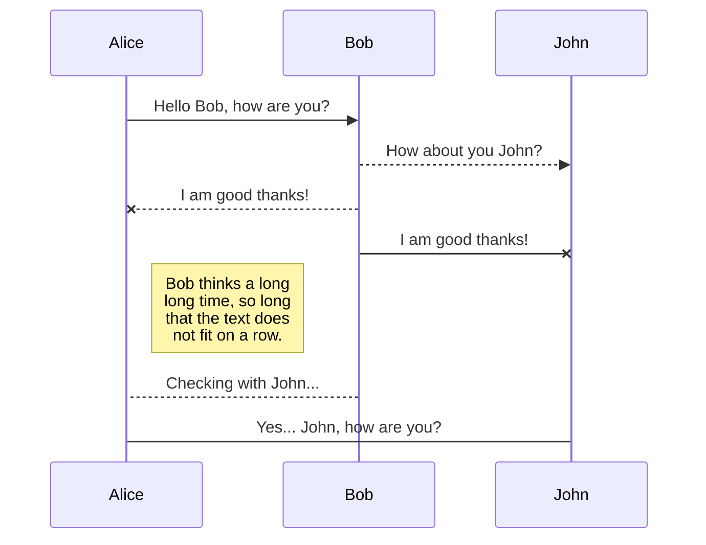
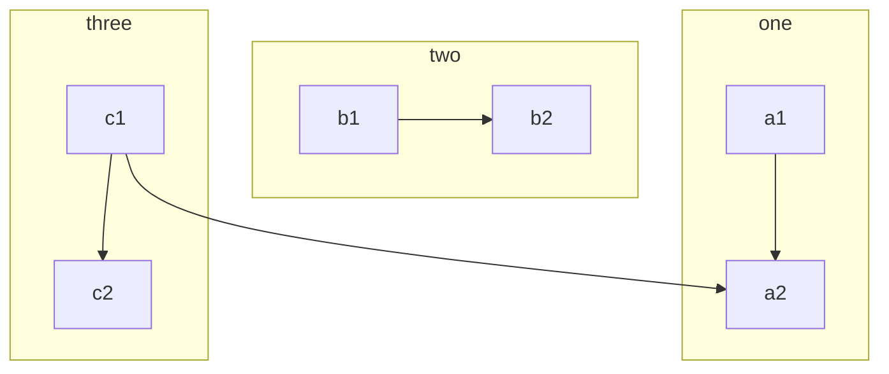

# new evening
``` html
<head>
    <meta charset="utf-8">
  <link rel="dns-prefetch" href="https://github.githubassets.com">
  <link rel="manifest" href="/manifest.json" crossOrigin="use-credentials">

  </head>
<h1> Hello </h1>
  <body class="logged-in env-production page-responsive" style="word-wrap: break-word;">
    <div data-turbo-body class="logged-in env-production page-responsive" style="word-wrap: break-word;">
      


    <div class="position-relative js-header-wrapper ">
      <a href="#start-of-content" class="p-3 color-bg-accent-emphasis color-fg-on-emphasis show-on-focus js-skip-to-content">Skip to content</a>
      <span data-view-component="true" class="progress-pjax-loader Progress position-fixed width-full">
    <span style="width: 0%;" data-view-component="true" class="Progress-item progress-pjax-loader-bar left-0 top-0 color-bg-accent-emphasis"></span>
</span>  
```


## KaTeX

You can render LaTeX mathematical expressions using [KaTeX](https://khan.github.io/KaTeX/):

The *Gamma function* satisfying $\Gamma(n) = (n-1)!\quad\forall n\in\mathbb N$ is via the Euler integral

$$
\Gamma(z) = \int_0^\infty t^{z-1}e^{-t}dt\,.
$$
